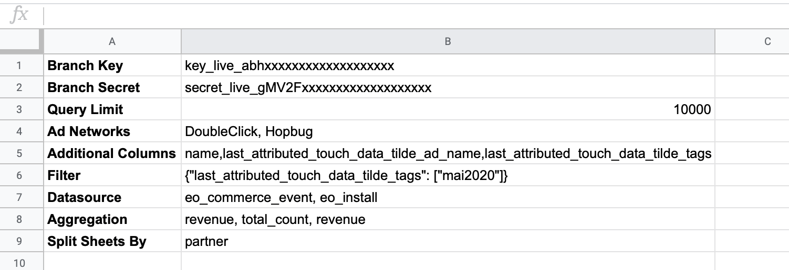
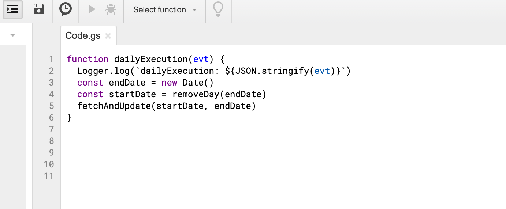
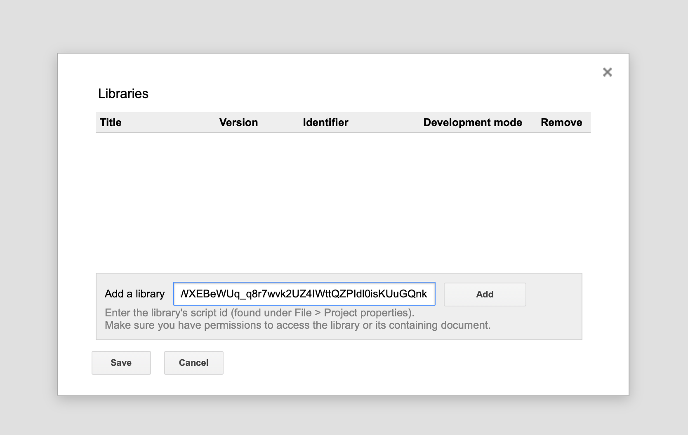
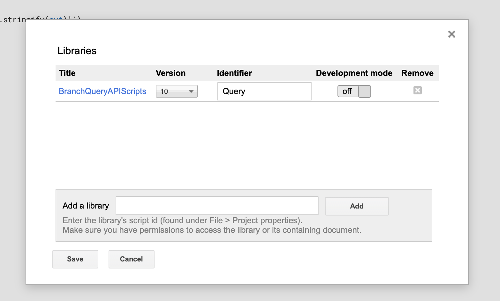
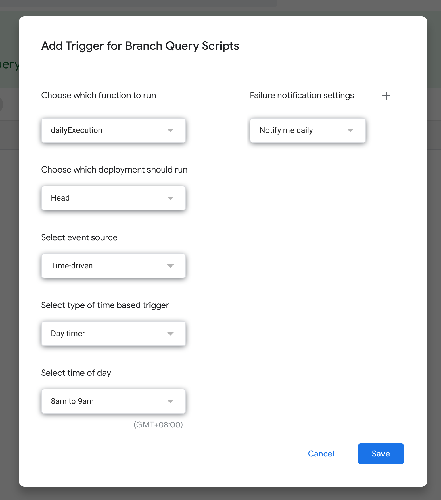
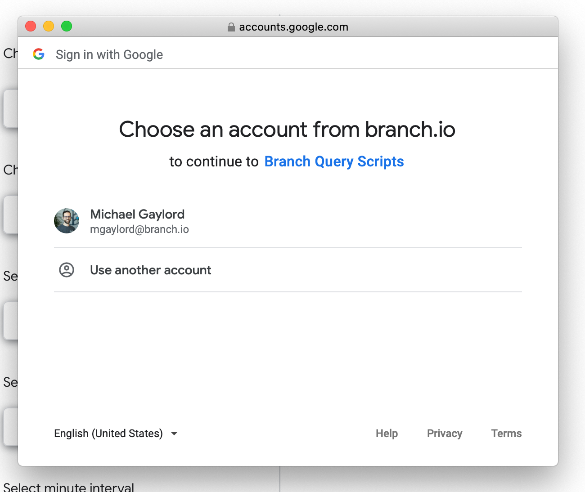
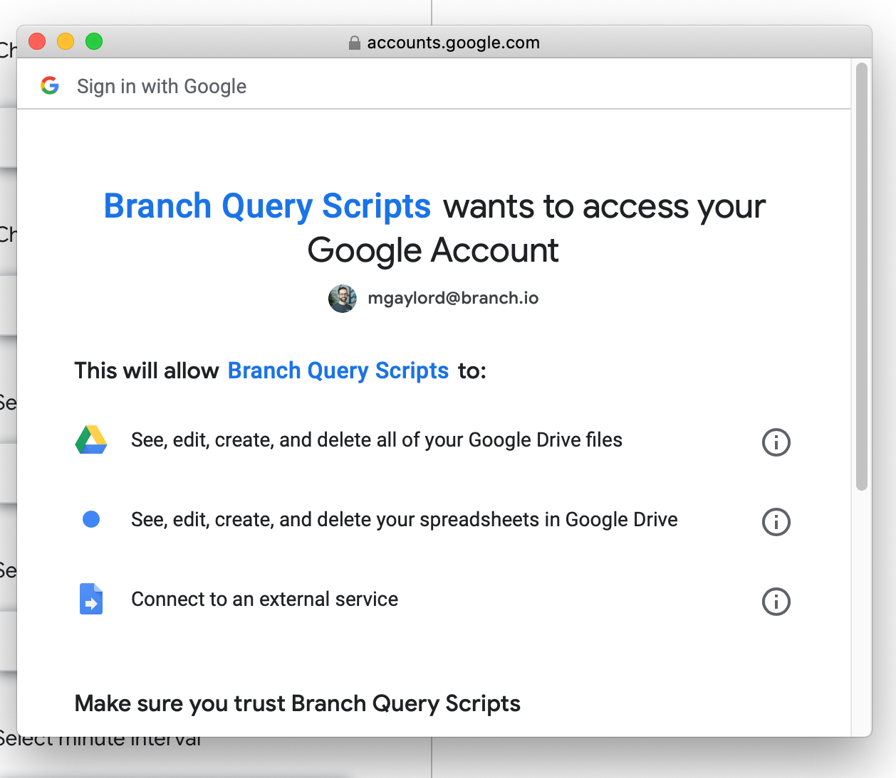

# Branch Query API Google Sheets Scripts

## What do they do?

The query scripts will pull commerce data each day for Ad Networks and populate the Google Sheet accordingly. Currently, you can only do one aggregation at a time.

## Installation:

1. Add a sheet to your Google Sheet and name it Settings
2. Add rows to the sheet with the names:
	- Branch Key
	- Branch Secret
	- Query Limit
	- Additional Columns
	- Ad Networks
	- Datasource
	- Aggregation
	- Filter
	- Split Sheets By
3. For each of those rows, populate with the following:
	- Branch Key: Retrieve from the Account Settings section of the Branch Dashboard
	- Branch Secret: Retrieve from the Account Settings section of the Branch Dashboard
	- Query Limit: Set this by default to 1000 - this is capped at 10 000 rows.
	- Additional Columns: If you require additional data in the report, please add them in a comma separated list. For more information on the available columns refer to the *dimensions* section of the documentation: https://help.branch.io/developers-hub/docs/query-api#section-data-selection
	- Ad Networks: Populate with a comma separated list of ad network names. You can retrieve this list from the list from the Branch dashboard under Ads -> Partner Management. Leave *blank* if you would like to fetch all ad network data.
	- Datasource: Comma separated list of datasources. Available datasources can be found here: https://help.branch.io/developers-hub/docs/query-api#section-data-selection
		Note: the names are case sensitive and need to be input exactly as they appear on the Branch dashboard. e.g. Google AdWords *not* Google adwords
	- Aggregation: Possible values - `revenue`, `total_count`, `unique_count`, `cost`. If you would like to have multiple aggregations separate them with a comma e.g. `revenue, total_count` For a description of these values, see here: https://help.branch.io/developers-hub/docs/query-api#section-data-selection 
	- Filter: If you would like to filter the results you can add multiple filters - just be sure that the it is valid JSON. An example filter on tags is: `{"last_attributed_touch_data_tilde_tags": ["some_tag"]}` For more information on filters visit: https://help.branch.io/developers-hub/docs/query-api#section-data-selection
	- Split Sheets By: currently only accepts `partner` as a value. If blank all results will be loaded into a single sheet.



1. Once Settings are complete in the sheet, select Tools -> Script Editor from the menu
2. The script editor will open. Give the project a name e.g. Branch Query Scripts
3. Replace the function 
```
myFunction() {
	
}
```

with

```
function dailyExecution(evt) {
  Logger.log(`dailyExecution: ${JSON.stringify(evt)}`)
  const endDate = new Date()
  const startDate = removeDay(endDate)
  fetchAndUpdate(startDate, endDate)
}
```



7. Save the script
8. Select Resources -> Libraries from the menu
9. In the Add Library section copy and paste this Script ID: `1j5qtnmGRka-wUt96WXEBeWUq_q8r7wvk2UZ4IWttQZPIdl0isKUuGQnk` and press Add



10. Replace the Identifier with `Query` and make sure the latest Version is selected



11. Press Save
12. From the menu Select Edit -> Current Project's Triggers
13. In the new tab that opens: Add a Trigger
14. Set the Event Source to Time-driven and the Timer to Day Timer (the defaults for time are fine) and press Save



15. You will need to give permission to the scripts to access your Google account. This is required in order to edit the sheet. Note: If your browser blocks popups, you might need to allow popups in order to run through verification.




That's it. When the trigger is executed you will see the data appear as separate sheets for each Ad Network. Just add more Ad Networks (Step 3) if you want their data to start showing up.

